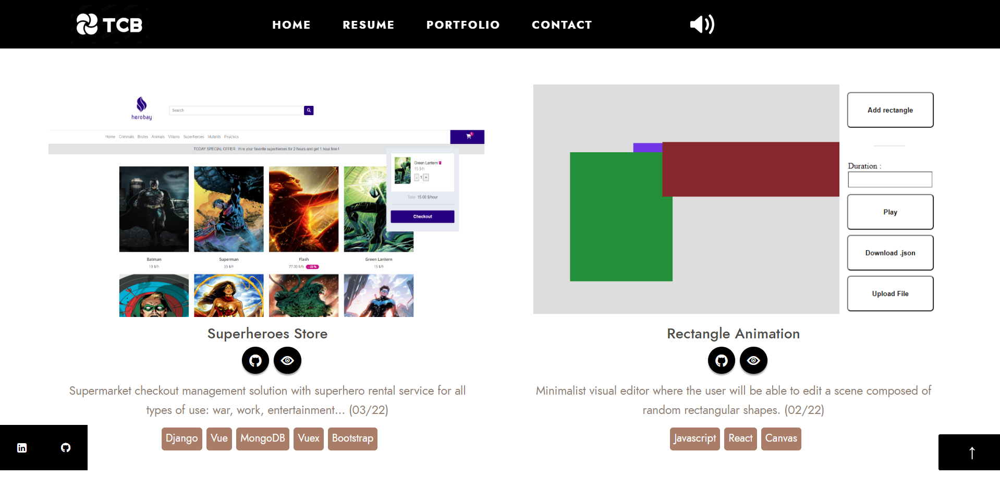

<br />
<p align="center">
  <a href="https://github.com/Thibault-collard/CV-portfolio">
    
  </a>

  <h3 align="center"> CV Portfolio </h3>

  <p align="center">
    CV Portfolio to display my resume, my portfolio and my contact details to recruiters and potential clients
		<br />
    <br />
    <a href="https://thibault.collard-bovy.com/">View Online Demo</a>
    <a href="https://github.com/Thibault-collard/CV-portfolio/issues">Report a Bug</a>
    <a href="https://github.com/Thibault-collard/CV-portfolio/pulls">Suggest a modification</a>
  </p>
</p>

<!-- ABOUT THE PROJECT -->
## About this projet

The most important part of this project is to present my previous works in coding:

- React/TS
- HTML Template for Ikonik 
- Sendgrid to send emails
- Gcloud to host website
- Github and Docker to deploy the website

With this version, you'll be able to : 
- Watch my resume
- Contact me
- Check all my previous works

<!-- GETTING STARTED -->
## Start the project ...

To quickly checkout this project, you don't need any credentials, just click on this link: https://thibault.collard-bovy.com/

### Prerequisite

In addition to having an adequate programming environment, it is necessary to have notions in React and basic html to fully understand this project. 

```

### Installation

1. Clone the repo
```sh
git clone https://github.com/Thibault-collard/thibault.collard-bovy.git
```
2. Instal NPM packages
```sh
npm install
```
4. Build and launch the server
```sh
npm run start
```
To replicate this project, you don't need any type of credentials or API Key

<!-- USAGE EXAMPLES -->
## Skills Used

- Transform HTML template into React components
- Create Responsive Design interface
- Connect E-mail provider to send email
- Use audio player to play song
- Deploy to Google Cloud

<!-- LICENSE -->
## Licence

This folder and all of the code it contains is freely accessible, without the need for attribution. But remember that copying without understanding will not advance your skills.

<!-- CONTACT -->
## Contact

For all requests: thibault.collard@gmail.com


